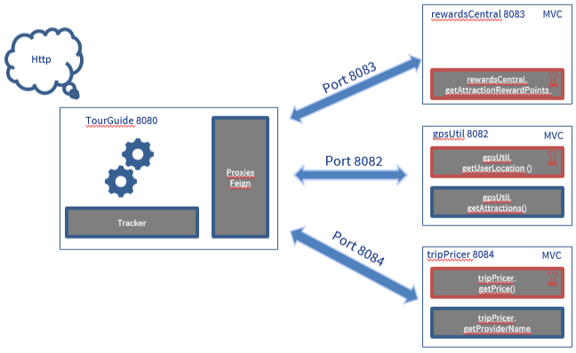

# GpsUtil
API REST micro-service for TourGuide application to managing travel and attraction for a custumer.
GpsUtil manage Gps informations. 
This app use SPRINT BOOT, FeignClient.

## Getting Started

- Endpoint : http://localhost:8082/...
- Or : http://gpsutil:8082/...

## Prerequisites

- Java 1.8 or later
- Spring Boot 2.2.6
- Gradle 2.2.5
- Docker 2.5.0.0 (Optional)

# Installation

## No Database creation needed

### Without Docker
To start the application whitout docker start sub-micro-service with or without docker in build libs directories: 
- Gpsutil : java -jar gpsUtil-0.0.1-SNAPSHOT.jar

### With Docker
Docker construction in project directory :  
- docker build --build-arg JAR_FILE=build/libs/*.jar -t gpsutil .

Docker execution : 
- docker run -p 8082:8082 --name GpsUtil gpsutil

or
- docker run -p 8082:8082 --name GpsUtil --cpus="1" gpsutil
# Architecture Diagram

# URI
## Get User Location
It's call with UUID for the userId
Example : 
GET http://localhost:8082/getUserLocation?attractionId=123e4567-e89b-12d3-a456-426614174000&userId=123e4567-e89b-12d3-a456-426614174000

## get User LocationV2
It's call with String for the userId
Example : 
ET http://localhost:8082/getUserLocationV2?attractionId=123e4567-e89b-12d3-a456-426614174000&userId=123e4567-e89b-12d3-a456-426614174000

## Get Attractions
Return all attractions
Example : 
http://localhost:8082/getAttractions
